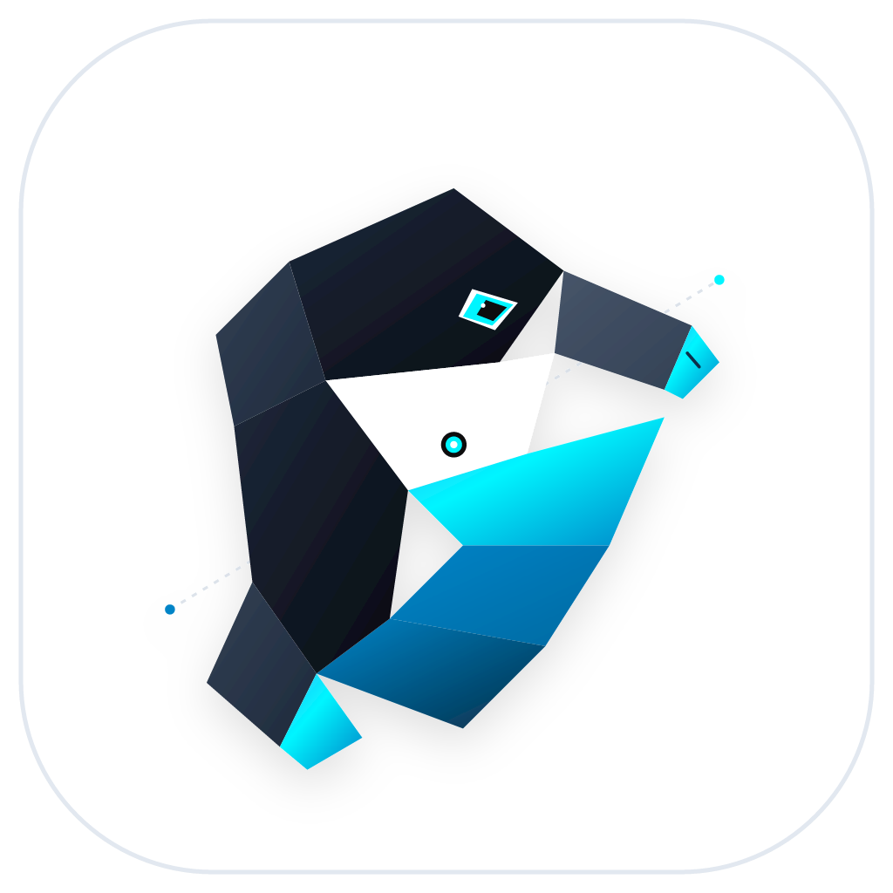
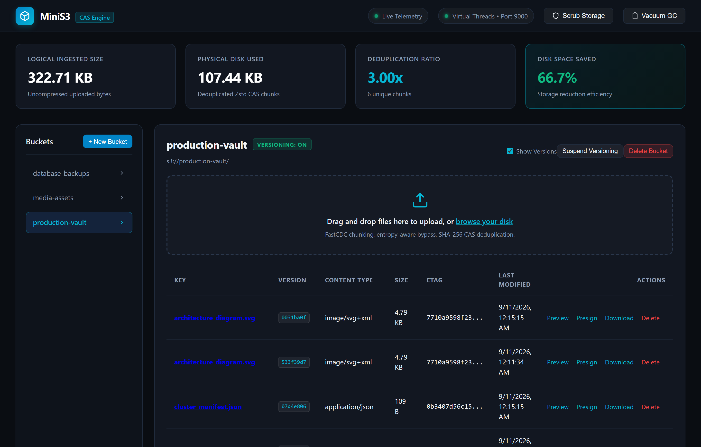
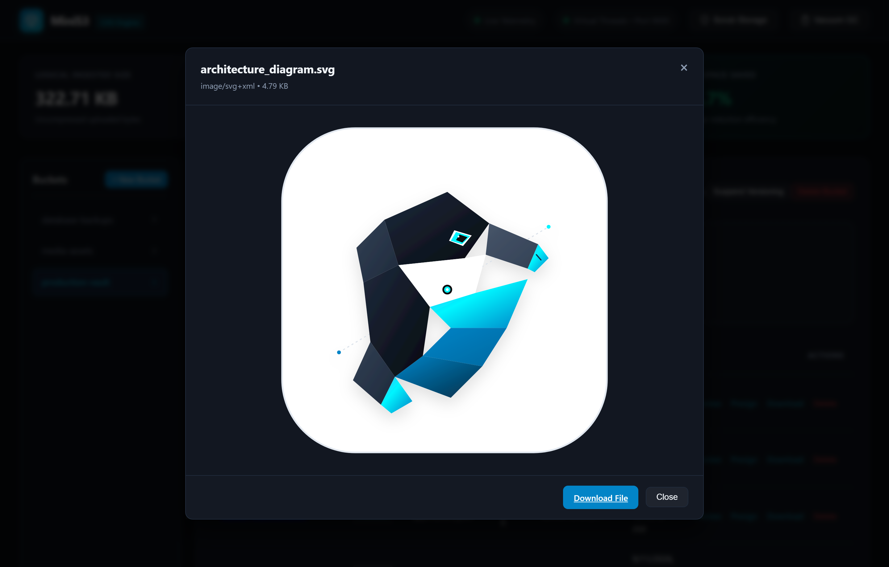
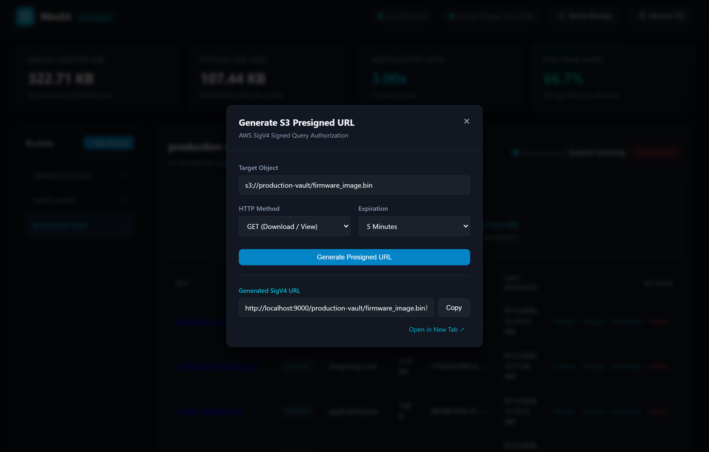

<p align="center">
  
</p>

<h1 align="center">MiniS3</h1>

<p align="center">
  <strong>Lightweight S3-Compatible Content-Addressable Storage Engine</strong><br>
  <em>Deterministic SHA-256 CAS Deduplication &bull; Zstandard Compression &bull; FastCDC &bull; AWS SigV4 &bull; Java 21 Virtual Threads</em>
</p>

<p align="center">
  <a href="LICENSE"></a>
  <a href="#"></a>
  <a href="#"></a>
  <a href="#"></a>
  <a href="#"></a>
</p>

---

MiniS3 is an S3-compatible content-addressable storage (CAS) engine written in Java 21 LTS using Spring Boot 3.3 and Virtual Threads. It implements the AWS S3 REST API and AWS Signature Version 4 authentication while deduplicating identical object payloads across buckets using SHA-256 content addressing and Zstandard block compression.

## Visual Console & Real Telemetry

MiniS3 includes an embedded real-time web console accessible directly at `http://localhost:9000`. The console communicates over Server-Sent Events (SSE) to display deduplication ratios, byte savings, object version trees, and background storage maintenance status.

### Main Telemetry & Object Explorer
Inspect physical versus logical storage footprints, toggle object version listings, drag-and-drop uploads, and trigger background storage scrubs:

<p align="center">
  
</p>

### Built-in Media & Document Previewer
Preview images, vector SVGs, JSON documents, markdown, and audio/video files directly in the browser without third-party tools:

<p align="center">
  
</p>

### S3 Presigned URL Generator
Generate standard AWS SigV4 signed query parameter URLs with configurable expiration windows:

<p align="center">
  
</p>

---

## Why MiniS3 exists

Local development environments and integration test pipelines frequently require object storage to simulate AWS S3. Standard local alternatives like MinIO have grown heavy, memory intensive, and complex to bundle in small developer environments.

Standard object stores also write data redundantly to disk. If multiple services or test suites upload identical 50 MB artifacts, test fixtures, or container layers with different keys, the storage engine writes duplicate bytes each time.

MiniS3 addresses this with a content-addressable storage core:
- Payloads are indexed by SHA-256 hash before disk writes.
- If an identical payload already exists in any bucket, MiniS3 increments a reference counter and skips the physical write.
- Unique payloads are compressed on ingestion using native Zstandard (`zstd-jni`), cutting disk footprint by 40% to 70% on typical JSON, text, and binary formats.
- An embedded web console provides visual bucket exploration and live telemetry on deduplication savings.

## Key capabilities

- **AWS S3 compatibility**: Implements core endpoints including bucket creation, single object PUT and GET, byte-range retrieval (`Range: bytes=start-end`), object deletion, and `ListObjectsV2` pagination.
- **Object versioning and multi-object delete**: Full S3 versioning lifecycle (`ENABLED`, `SUSPENDED`, `OFF`), non-current version tracking, delete markers, `GET ?versions` XML response, and batch `POST ?delete`.
- **FastCDC content-defined chunking**: Gear-hash rolling window partitioning with two-phase normalization for resilient deduplication under byte insertions and offset shifts.
- **Entropy-aware compression bypass**: Fast Shannon entropy estimation detects pre-compressed formats (gzip, mp4, zip) to bypass Zstandard compression and avoid CPU cycles.
- **Storage scrubber & bitrot detector**: Audits physical chunk integrity against recorded SHA-256 digests and reports health statistics.
- **Multi-credential IAM**: Dynamic API key management supporting scoped roles (`ADMIN`, `READ_WRITE`, `READ_ONLY`) and bucket restriction rules.
- **S3 Presigned URLs**: Generates and validates standard AWS SigV4 signed query parameter URLs with expiration limits.
- **Content-addressable deduplication**: Slices objects into deterministic SHA-256 chunks with cross-bucket deduplication.
- **Transparent Zstandard compression**: Native compression and decompression using high performance Zstd (`zstd-jni`).
- **S3 multipart uploads**: Supports initiating, uploading parts, completing, and aborting large chunked uploads.
- **Real-time SSE telemetry**: Embedded single-page dashboard featuring a live activity feed, bucket versioning controls, media player & document preview modal, and presign UI.
- **Java 21 Virtual Threads**: Handles concurrent streaming I/O with high throughput and low memory overhead.

## Mascot & Identity

<p align="center">
  
</p>

The emblem and mascot of MiniS3 is the **Anatomical Vault Pangolin (*Manis*)**.

- **Taxonomic & Phonetic Metaphor:** The genus *Manis* directly mirrors the **MiniS3** moniker.
- **Interlocking Keratin CAS Scales:** Just as the pangolin curls into an impenetrable geometric vault of interlocking dermal armor, MiniS3 composes files from deterministic cryptographic CAS scales (SHA-256 chunks).
- **Zstandard Compression & Bitrot Immunity:** The compact folded posture represents maximum storage density alongside automated background integrity verification.

## Architecture

MiniS3 follows hexagonal architecture (ports and adapters) to isolate core business rules from storage drivers and HTTP layers:

- `domain`: Pure Java 21 models (`Bucket`, `S3Object`, `ChunkHash`, `Chunk`, `ApiCredential`, `ScrubReport`), chunking ports, and SigV4 authentication validators. It contains zero framework dependencies.
- `application`: Use cases for bucket management, object streaming, FastCDC chunking, background scrubbing, and real-time SSE event publishing.
- `infrastructure`: Inbound REST controllers, SigV4 authentication filters, SQLite metadata repository (WAL mode), Zstandard CAS chunk store, and embedded web console.

For more details, see [docs/architecture.md](docs/architecture.md), [docs/cas-deduplication.md](docs/cas-deduplication.md), and [docs/s3-api-compatibility.md](docs/s3-api-compatibility.md).

## Quick start

### Prerequisites

- Java 21 LTS
- Maven 3.9+

### Build and run

```bash
mvn clean package
java -jar target/minis3-1.0.0-SNAPSHOT.jar
```

The server starts on port `9000` with default development credentials:
- Access Key: `minis3-access-key`
- Secret Key: `minis3-secret-key`
- Region: `us-east-1`

Open `http://localhost:9000` in a web browser to view the administrative console.

### Configuration

You can configure MiniS3 through `application.yml` or environment variables:

| Environment Variable | Default Value | Description |
|---|---|---|
| `MINIS3_PORT` | `9000` | HTTP server listening port |
| `MINIS3_DATA_DIR` | `./.minis3` | Base directory for chunks and SQLite metadata |
| `MINIS3_ACCESS_KEY` | `minis3-access-key` | AWS SigV4 root access key |
| `MINIS3_SECRET_KEY` | `minis3-secret-key` | AWS SigV4 root secret key |
| `MINIS3_REGION` | `us-east-1` | Default AWS region |

### Using with AWS CLI

Configure a profile or pass credentials inline:

```bash
export AWS_ACCESS_KEY_ID=minis3-access-key
export AWS_SECRET_ACCESS_KEY=minis3-secret-key
export AWS_DEFAULT_REGION=us-east-1

# Create a bucket
aws --endpoint-url=http://localhost:9000 s3 mb s3://my-bucket

# Upload a file
aws --endpoint-url=http://localhost:9000 s3 cp dataset.csv s3://my-bucket/dataset.csv

# Upload the same file under a different key (triggers deduplication)
aws --endpoint-url=http://localhost:9000 s3 cp dataset.csv s3://my-bucket/dataset-backup.csv

# List objects
aws --endpoint-url=http://localhost:9000 s3 ls s3://my-bucket/

# Download an object
aws --endpoint-url=http://localhost:9000 s3 cp s3://my-bucket/dataset.csv downloaded.csv
```

### Using with Python (Boto3)

```python
import boto3

s3 = boto3.client(
    "s3",
    endpoint_url="http://localhost:9000",
    aws_access_key_id="minis3-access-key",
    aws_secret_access_key="minis3-secret-key",
    region_name="us-east-1",
)

s3.create_bucket(Bucket="demo-bucket")
s3.put_object(Bucket="demo-bucket", Key="hello.txt", Body=b"Hello from MiniS3")

response = s3.get_object(Bucket="demo-bucket", Key="hello.txt")
print(response["Body"].read().decode("utf-8"))
```

### Using with AWS Java SDK v2

```java
S3Client s3 = S3Client.builder()
    .endpointOverride(URI.create("http://localhost:9000"))
    .region(Region.US_EAST_1)
    .credentialsProvider(StaticCredentialsProvider.create(
        AwsBasicCredentials.create("minis3-access-key", "minis3-secret-key")
    ))
    .forcePathStyle(true)
    .build();

s3.createBucket(b -> b.bucket("sample-bucket"));
s3.putObject(b -> b.bucket("sample-bucket").key("test.json"), RequestBody.fromString("{\"status\":\"ok\"}"));
```

## License

MIT License. See [LICENSE](LICENSE) for terms.
